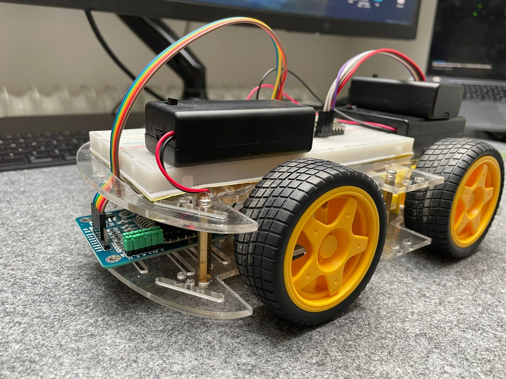

# Ferngesteuertes Auto mit ESP32

## Beschreibung 
In diesem Repository befindet sich meine Projektabgabe fuer das Informatik1 Labor an der Hochschule Karlsruhe. 
Fuer mein Projekt habe ich den ESP32 Mikroprozessor und die Anbindung an eine BlynkApp dazu verwendet, um ein ferngesteuertes Auto zu steuern.
Dieses besteht aus 4 DC-Motoren, welche über zwei L298N-Motortreiber angesteuert werden.

## Funktionsweise
Die BlynkApp stellt einen Joystick zur Verfügung, mit dem das Auto über WLAN gesteuert werden kann.
Hierzu werden im Programm die x und y Werte des Joysticks interpretiert, in einen Richtungsvektor überführt und dazu verwendet die Motoren anzusteuern.

 